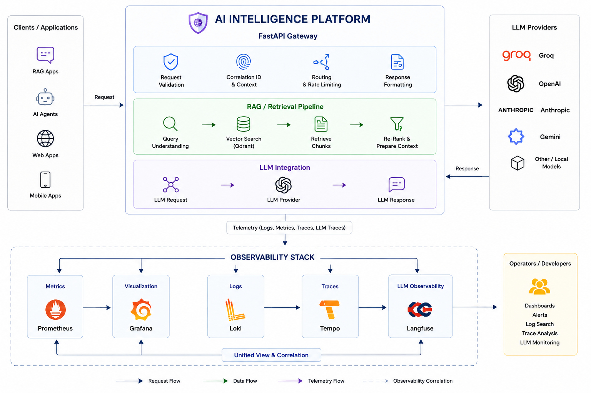

# AI Intelligence Platform

<!-- 


 -->


An **AI middleware and observability platform** designed to sit between AI applications and LLM providers.

The platform provides a centralized FastAPI gateway through which AI/RAG requests flow, while collecting telemetry across the application, retrieval pipeline, LLM interactions, and infrastructure.

> **Current Status:** Phase 2.5 — Observability & Tracing

---

## Overview

The project explores how an AI application can be built with **observability as a first-class concern**, rather than adding monitoring after the system is complete.

The gateway handles the application request flow while instrumentation captures:

* HTTP request metrics
* Request correlation IDs
* Structured application logs
* RAG and retrieval metrics
* LLM request and latency metrics
* Token usage
* Distributed traces
* LLM interaction traces

These signals are routed into dedicated observability systems and brought together through Grafana and Langfuse.

---

## Architecture

```text
                         AI Application
                               │
                               ▼
                    ┌────────────────────┐
                    │   FastAPI Gateway  │
                    │                    │
                    │ Request Handling   │
                    │ Correlation ID     │
                    │ Business Flow      │
                    └─────────┬──────────┘
                              │
                     ┌────────┴────────┐
                     ▼                 ▼
                RAG / Retrieval      LLM
                     │                 │
                     └────────┬────────┘
                              │
                              ▼
                           Response


                    OBSERVABILITY LAYER
                              │
             ┌────────────────┼────────────────┐
             │                │                │
             ▼                ▼                ▼
          Metrics            Logs           Traces
             │                │                │
             ▼                ▼                ▼
        Prometheus           Loki           Tempo
             │                                 ▲
             ▼                                 │
          Grafana                    OpenTelemetry
                                              
                              │
                              ▼
                         Langfuse
                    LLM Interaction Data
```

A complete visual architecture diagram is available in [`diagrams/architecture.png`](./diagrams/architecture.png).

---

## Observability

The platform separates observability concerns by signal:

| Signal            | Technology            | Purpose                                     |
| ----------------- | --------------------- | ------------------------------------------- |
| Metrics           | Prometheus            | Application, RAG, retrieval and LLM metrics |
| Visualization     | Grafana               | Dashboards and operational visibility       |
| Logs              | Loki                  | Centralized structured logs                 |
| Traces            | OpenTelemetry + Tempo | Distributed request tracing                 |
| LLM Observability | Langfuse              | LLM interaction and generation tracing      |

### Request Flow

```text
Request
   │
   ▼
Correlation ID
   │
   ▼
FastAPI Middleware
   │
   ├── HTTP Metrics
   ├── Structured Logs
   └── OpenTelemetry Trace
   │
   ▼
RAG / Retrieval
   │
   ├── Query Metrics
   ├── Retrieval Metrics
   └── Retrieved Chunks
   │
   ▼
LLM
   │
   ├── Request Metrics
   ├── Latency
   ├── Token Usage
   └── Langfuse Trace
   │
   ▼
Response
```

This allows a single request to be followed from the API layer through retrieval and LLM execution while correlating its **metrics, logs, and traces**.

---

## Key Engineering Work

* Designed a centralized AI gateway using FastAPI.
* Added request correlation across application components.
* Implemented structured logging and centralized log collection.
* Defined HTTP, RAG, retrieval, and LLM business metrics.
* Added Prometheus metrics and Grafana dashboards.
* Integrated OpenTelemetry for distributed instrumentation.
* Added Tempo for trace storage and exploration.
* Integrated Loki for centralized logs.
* Integrated Langfuse for LLM-level observability.
* Containerized the complete stack using Docker Compose.

---

## Technology Stack

**Backend**

FastAPI • Python • PostgreSQL • RAG • Qdrant

**AI / LLM**

LLM APIs • Embeddings • Retrieval Pipeline

**Observability**

OpenTelemetry • Prometheus • Grafana • Loki • Tempo • Langfuse

**Infrastructure**

Docker • Docker Compose

---

## Project Scope

The current showcase represents the work completed through **Phase 2.5**.

The focus here is the **gateway, RAG/LLM pipeline, and observability infrastructure**.

AI quality evaluation, hallucination detection, advanced guardrails, and other AI intelligence capabilities belong to subsequent phases and are intentionally outside the current implementation scope.

---

## Demo

A walkthrough of the running platform and its observability stack is available here:

**[▶ View Demo Recording](./demo/demo.mp4)**

---

## Architecture Diagram


