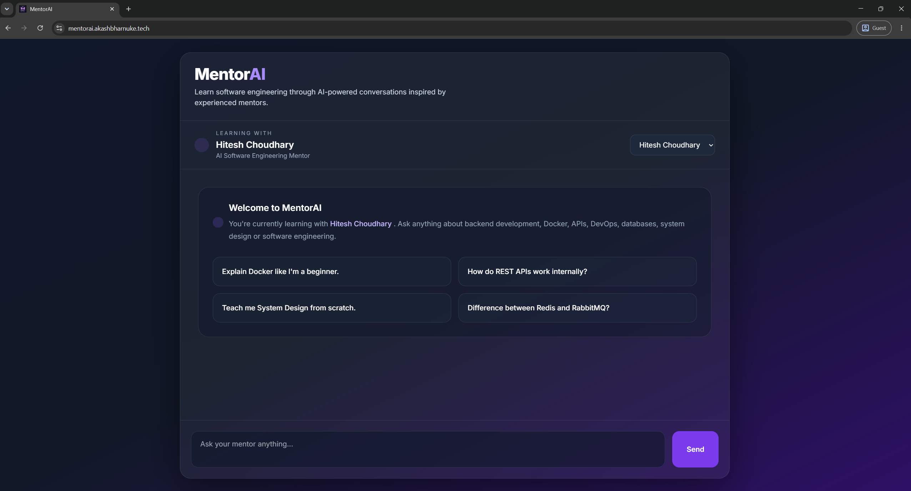

# MentorAI

An AI-powered chatbot that simulates conversations with **Hitesh Choudhary** and **Piyush Garg** using OpenAI, persona engineering, and contextual prompting.


---

## 🔗 Links

* <a href="https://mentorai.akashbharnuke.tech">🌐 **[ Live Demo ]**</a>
* <a href="https://github.com/AkashBharnuke/MentorAI">💻 **[ GitHub ]**</a>
* 🎥 **Demo Video:** `demo/mentor-ai-demo.mp4`

---

## 📸 Project Preview



---

## 🎥 Demo

A short walkthrough of MentorAI is available in the `demo/` directory.

```
demo/
└── mentorai-demo.mp4
```

---

## 🚀 Overview

MentorAI is a persona-driven LLM application that recreates conversations inspired by two well-known software engineering educators—**Hitesh Choudhary** and **Piyush Garg**.

Rather than building a generic chatbot, the goal was to simulate each mentor's communication style, teaching approach, and personality using carefully designed prompts and contextual conversations.

The project was built entirely with **Vanilla JavaScript**, **Express.js**, and the **OpenAI API**, without using AI orchestration frameworks such as LangChain or CrewAI.

---

## ✨ Key Highlights

* 🎭 Two distinct AI mentor personas
* 🧠 Custom persona engineering
* 💬 Multi-turn conversational context
* ⚡ Modular prompt construction
* 📝 Markdown rendering with syntax-highlighted code blocks
* 🐳 Dockerized deployment
* 🌐 Self-hosted on a VPS behind Nginx

---

## 🛠️ Tech Stack

| Layer      | Technologies                            |
| ---------- | --------------------------------------- |
| Frontend   | HTML5, Tailwind CSS, Vanilla JavaScript |
| Backend    | Node.js, Express.js                     |
| AI         | OpenAI API                              |
| Rendering  | Marked.js, Highlight.js                 |
| Deployment | Docker, Docker Compose, Nginx, VPS      |

---

## 🏗️ Architecture

```text
Browser
    │
    ▼
Frontend (HTML + JavaScript)
    │
    ▼
Express API
    │
    ▼
Prompt Builder
    │
    ├── Persona Context
    ├── Conversation History
    ├── System Prompt
    └── User Query
    │
    ▼
OpenAI API
    │
    ▼
Assistant Response
```

---

## 📚 What I Learned

Building MentorAI helped me explore several concepts beyond simply integrating an LLM.

* Designing reusable persona profiles
* Prompt engineering without AI orchestration frameworks
* Session-based conversation context management
* Modular Express application architecture
* Serving both frontend and backend from a single Express application
* Dockerizing and deploying AI applications on a VPS
* Using Nginx as a reverse proxy with SSL

---

## 📁 Repository

The complete source code, documentation, and deployment configuration are available in the main MentorAI repository.

This showcase page provides a high-level overview of the project, while the primary repository contains the implementation details, architecture documentation, and setup instructions.
